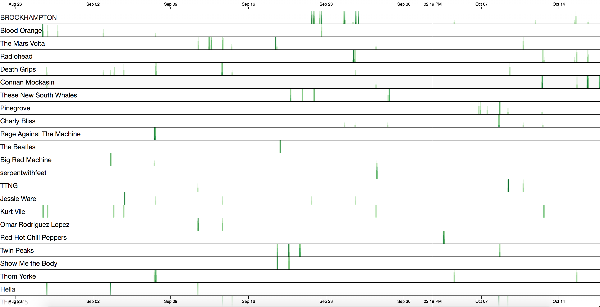

# Wilt - What I Listen To

[](https://travis-ci.org/oliveroneill/wilt)

This is a browser client for displaying Wilt metrics.

This will display a timeline of play history for the specified user.
Inspired by [LastWave](https://github.com/taurheim/LastWave).

## Installation
Create a `constants.js` file to specify the Google Cloud Functions backend and
username that you want to query on.
Format is:
```javascript
// Firebase config
const firebaseConfig = {
  apiKey: '<ENTER-FIREBASE-API-KEY>',
  authDomain: '<AUTH-DOMAIN>',
  projectId: '<FIREBASE-PROJECT-ID>',
};

// Spotify config
const spotifyConfig = {
  clientId: '<ENTER-SPOTIFY-CLIENT-ID>',
  redirectUri: '<ENTER-SPOTIFY-REDIRECT-URI>',
};
```

Set firebase function configuration:
```bash
firebase functions:config:set spotify.client_id="<ENTER-SPOTIFY-CLIENT-ID>" spotify.client_secret="<ENTER-SPOTIFY-CLIENT-SECRET>"
```

## Setup
This project uses BigQuery, Firestore and Firebase Authentication.

### BigQuery
You'll need to create a BigQuery table called `wilt_play_history.play_history`.

#### Table Columns
play_history (BigQuery): user_id, date, artists, name, primary_artist, track_id

users (FireStore): access_token, expires_at, refresh_token

### FireStore
You'll need to create a table called `users`.


## Testing
```bash
npm test
```
Tests are run using [cypress](https://www.cypress.io/).
To use the UI run `npm run cypress:open`, however for some reason the
visual regression tests will fail when run via the UI - I'm still investigating
this.

NOTE: the timezone for the tests is `Australia/Sydney`. This is a limitation of
cypress, documented [here](https://github.com/cypress-io/cypress/issues/1043).
Travis has been setup with this timezone.

The base snapshots were run on macOS and don't lineup the same when compared to
Linux. Potentially we should add different snapshots for each platform.

## Screenshot
The current graph is a stacked area graph for artist plays per week for a
specific user. Note: when you hover over points it will show *some*
points, however it won't show all of them.



## TODO
- Testing around login page
- Better annotation placement
- Fix hover labels not showing every point
